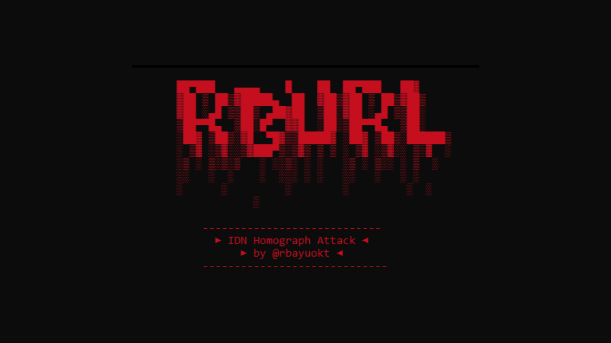
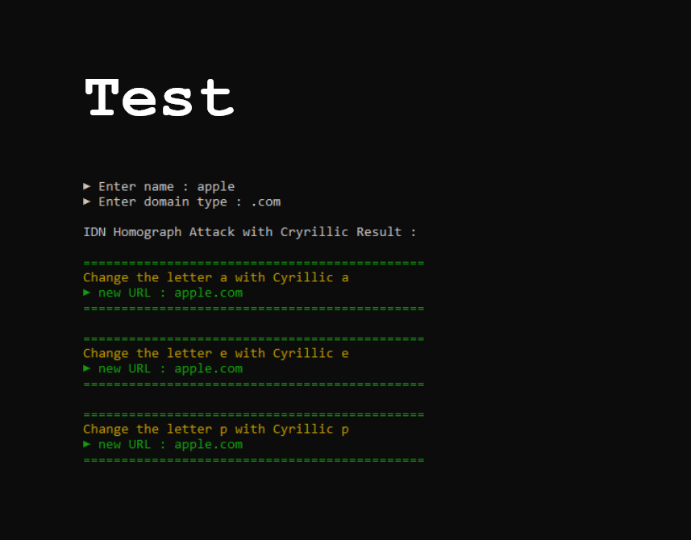
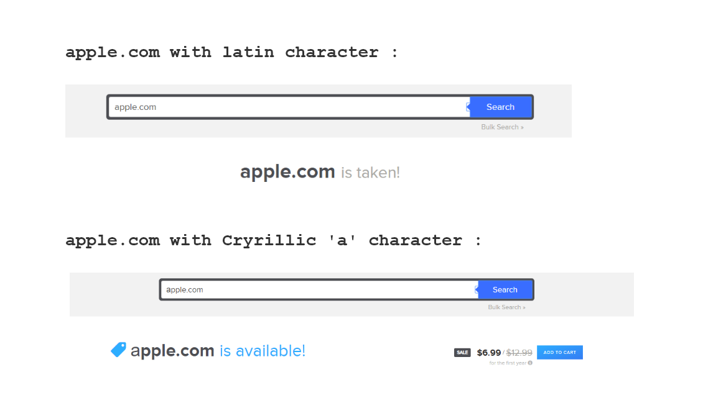
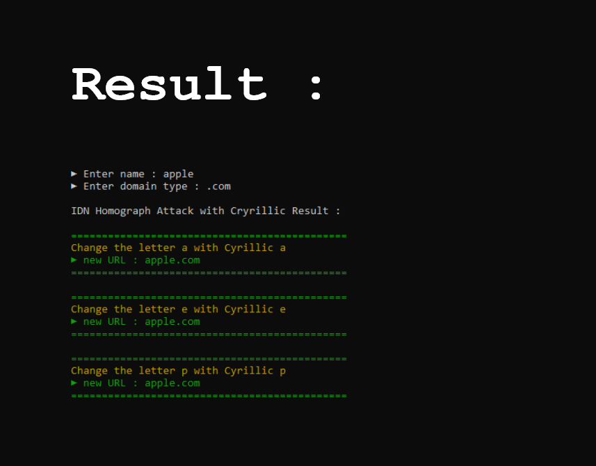

# rbURL - HomographAttack
<center></center><br>
The internationalized domain name (IDN) homograph attack is a way a malicious party may deceive computer users about what remote system they are communicating with, by exploiting the fact that many different characters look alike (i.e., they are homographs, hence the term for the attack, although technically homoglyph is the more accurate term for different characters that look alike).

# REQUIREMENT
1. Install python
2. clone this rbURL
3. run with command

```bash
py rbUrl.py
```

# Let me explain
For the example :
human eyes see all URLs are the same, nothing suspicious or strage<br>
<b>But not with the computer</b><br>
exaple , human eyes see apple.com just like normal<br>
<b>But computer see there is a Cyrillic character inside 'apple' in 'a' letter<br>
if you type apple.com in browser , there is nothing happened , it's an official web of apple<br>
but if you type 'apple.com' with 'a' letter is change to Cyrillic character, it will shock you<br>
<b>apple.com is empty</b> because u use 'a' letter of Cyrillic to fake human eyes. <br>
<br>
That mean , you can buy that domain and <b>you can do something crazy like phising with another level</b><br>
 
in this case I'll use my tools to perform this attack and the target is apple.com<br>
<b>REMEMBER , THIS IS FOR EDUCATIONAL PURPOSES ONLY !</b><br>

perform attack : <br>
<br><br>

check the domain for the result : <br>
<br><br>

see ? you can buy domain apple.com<br>
<b>cause there is Cyrillic character included.</b>

# Screenshoot
Logo : <br>
<br><br>

Main Menu : <br>
<br><br>

Result : <br>
<br><br>

made with :heart: in Cimahi by [@rbayuokt](https://www.instagram.com/rbayuokt/) :thumbsup:
